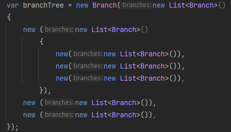

# SimpleBinaryTreeConsoleApp
Hierarchical structure of binary trees.

An ASP.NET Core Console .NET 6 application which calculates the depth of provided structure using recursion.

### To run your program:

If you are new to .NET visit [microsoft.com](https://dotnet.microsoft.com/en-us/learn)

1. You need to clone or download project from GitHub [project page](https://github.com/kristaps-m/SimpleBinaryTreeConsoleApp)
2. You need the .NET Framework and an IDE (integrated development environment) to work with the C# language. [Try this page to get started.](https://www.simplilearn.com/c-sharp-programming-for-beginners-article)
3. Open and run project with capable IDE of your choice. I used Visual Studio in example below.

4. In picture below we can see that depth is 3.

5. Feel free to modify the tree and increase the depth and run the aplication. And look how tree grows from one to much more complex.
